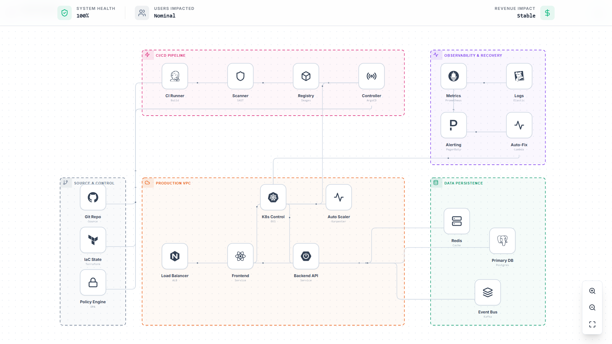
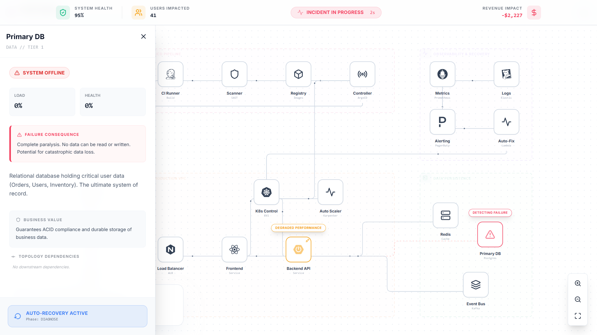
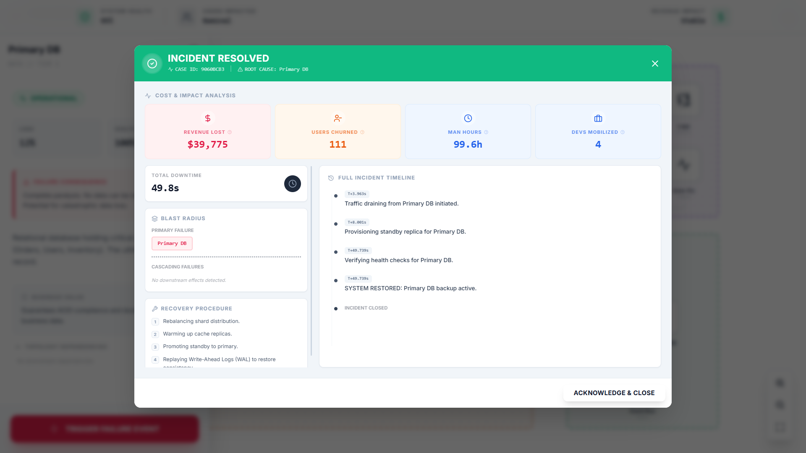
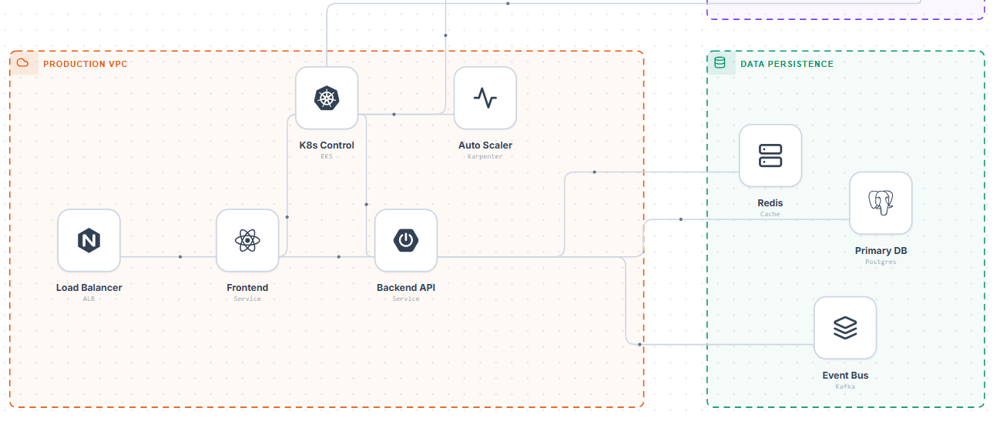

# 💥 Blast Radius: Chaos Engineering Simulator

<div align="center">

 

### **Experience the Beauty of Failing Architectures.**
A browser-based interactive simulation where *collapse* is the feature, not a bug.

[](https://youtu.be/z9WybBBcmFo) &nbsp;&nbsp; [](https://blast-radius.vercel.app/)
</div>

---

## 🧐 The Philosophy: Why "System Collapse"?

> **"Everything fails, all the time."** — Werner Vogels, CTO of Amazon

Distributed systems are notoriously fragile. In the modern cloud-native stack (Kubernetes, Microservices, Event Buses), the surface area for failure is massive. Yet, we rarely teach engineers **how** things break. We only teach them how to build.

**Blast Radius** was built to solve the **"On-Call Gap"**:
1.  **Invisible Risks:** It is often unclear how a minor failure (e.g., a Redis cache eviction) cascades into a total system outage.
2.  **High Stakes:** You can't just "break" production to learn dependencies. It costs money and reputation.
3.  **Lack of Empathy:** Junior engineers rarely feel the emotional weight of a "Revenue Loss" ticker until they are holding the pager at 3 AM.

**Blast Radius is a flight simulator for SREs.** It allows you to inject failure into a complex system and watch exactly how it propagates—safely.

---

## 🏗️ The Architecture: A Living Topology

Unlike static diagrams, **Blast Radius** models a complete, living DevOps lifecycle. Every node is part of a directed graph state machine.

### **Zone 1: Control Plane 🛡️**
*   **Git Repo:** The source of truth. If this breaks, developers cannot push fixes.
*   **Terraform (IaC):** Infrastructure state. If this desyncs, the cloud reality drifts.
*   **Policy Engine:** Security gates. If this fails, deployments are blocked or unsafe.

### **Zone 2: CI/CD Pipeline ⚙️**
*   **CI Runners:** The build factory.
*   **Artifact Registry:** Where Docker images live.
*   **ArgoCD Controller:** The GitOps sync mechanism.

### **Zone 3: Production Runtime 🚀**
*   **Kubernetes Control Plane:** The brain. If this dies, no new pods can schedule.
*   **Load Balancers:** The front door. 
*   **Microservices:** Frontend and Backend APIs dependent on data layers.

### **Zone 4: Data & State Plane 💾**
*   **Redis Cache:** Sub-millisecond data. Failure here leads to the "Thundering Herd" on the DB.
*   **Postgres DB:** The system of record. Failure here is catastrophic.
*   **Kafka Event Bus:** Asynchronous messaging.

### **Zone 5: Observability 👁️**
*   **Prometheus/Grafana:** Metrics.
*   **ELK Stack:** Logs.
*   **PagerDuty:** Alerting. If this breaks, you are flying blind.

---

## ⚡ Key Features

### 🎮 Interactive Chaos Injection
You are the **Platform Engineer**. Click on any node—from the *Git Repo* to the *Database*—and trigger a **Failure Event**. 
*   **Visualized Latency:** Watch traffic particles slow down, turn red, and vanish.
*   **Shockwaves:** See the "Blast Radius" visually expand to dependent nodes.

### 📉 Real-Time Business Impact
We don't just show CPU spikes; we show what matters to the business.
*   **💸 Revenue Loss Ticker:** Watch money burn in real-time.
*   **😡 User Frustration Index:** Tracks churn probability.
*   **⏱️ SLA Breach Countdown:** The time remaining before you violate contracts.

### 🤖 Automated Recovery & Forensics
The system isn't helpless. It fights back.
1.  **Diagnose:** System identifies the fault.
2.  **Drain:** Traffic is rerouted.
3.  **Standby Activation:** Warm replicas are promoted.
4.  **Post-Mortem:** Once resolved, generate a detailed **Incident Report** showing man-hours lost and root cause analysis.

---

## 📸 Screenshots

*(Ensure you upload these images to the `screenshot/` folder)*

| The Dashboard | Triggering Chaos |
|:---:|:---:|
|  |  |
| *A living, breathing topology.* | *Injecting failure into the Database.* |

| Post-Mortem | Logic |
|:---:|:---:|
|  |  |
| *Automated incident analysis.* | *Detailed node telemetry.* |

---

## 💻 Tech Stack

Built for high-performance animation and complex state management.

*   **⚛️ Core:** React 18 + TypeScript
*   **🎨 Styling:** Tailwind CSS (Glassmorphism/HUD UI)
*   **🎬 Animation:** Framer Motion (Orchestration & Enter Transitions)
*   **🕸️ Visualization:** Custom SVG Engine with Bezier Curve Algorithms (`ConnectionLines.tsx`)
*   **⏱️ Simulation:** 60fps `requestAnimationFrame` Game Loop

---

## 🚀 Getting Started

1.  **Clone the Repository**
    ```bash
    git clone https://github.com/DhruvP2205/blast-radius.git
    cd blast-radius
    ```

2.  **Install Dependencies**
    ```bash
    npm install
    # or
    yarn install
    ```

3.  **Run Simulation**
    ```bash
    npm start
    ```
    Open [http://localhost:3000](http://localhost:3000) to view it in the browser.

---

## 🤝 Contributing

We welcome contributions! Specifically looking for:
*   **Red Team Scenarios:** Logic for DDoS attacks or Ransomware simulation.
*   **Sound Engineering:** Adding ambient server hums and alarm klaxons.

---

## 🔗 Connect

*   **Live Demo:** https://blast-radius.vercel.app/
*   **YouTube Walkthrough:** https://youtu.be/z9WybBBcmFo
*   **LinkedIn:** https://www.linkedin.com/in/dhruv-prajapati-cybersecurity/

---

<div align="center">

*Built with ❤️ and a lot of anxiety for the System Collapse Hackathon.*


</div>
